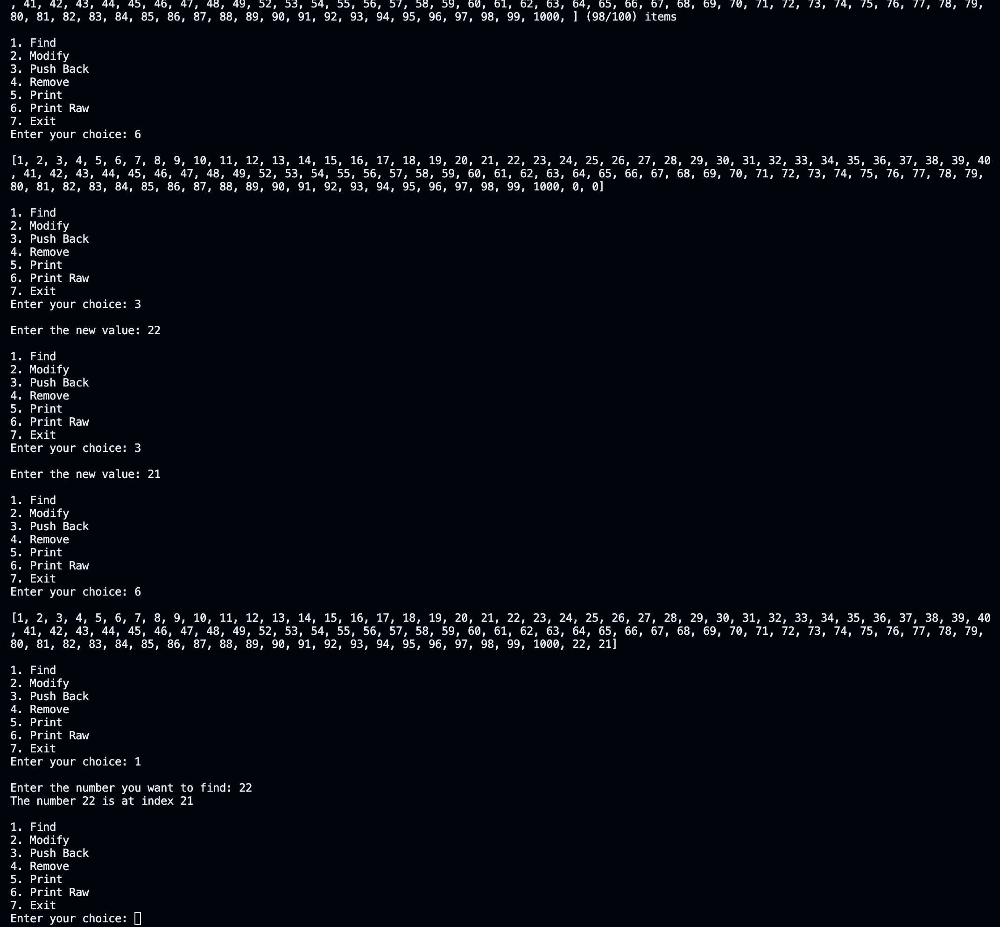
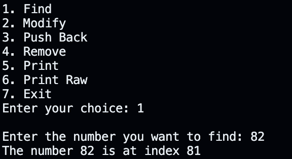
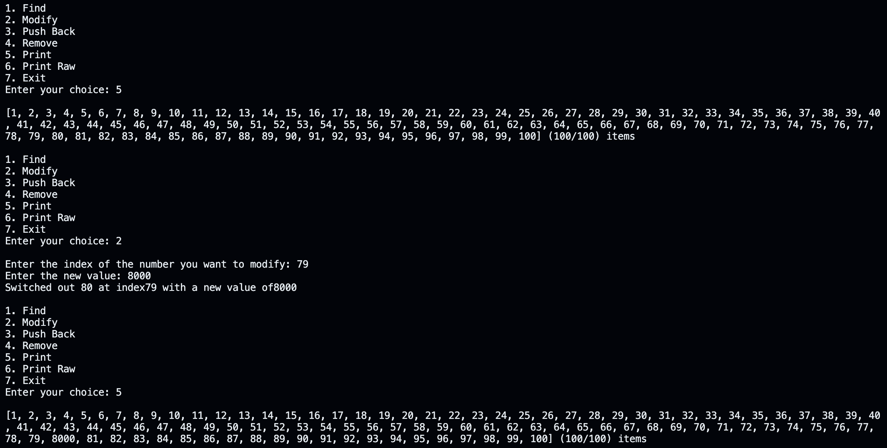
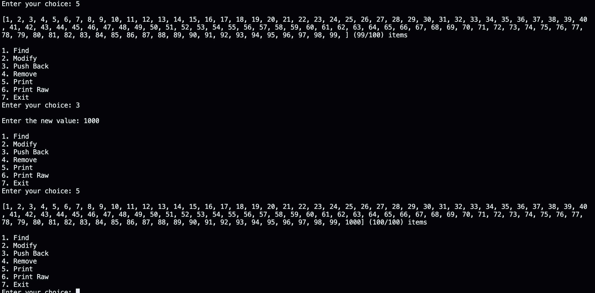
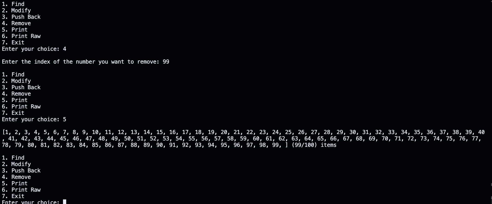

# CS-303 Assignment 1



## Setup

```bash
# Clone the repository
git clone https://github.com/spigelli/Data-Structures-Assignment-1

# Change to the project directory
cd Data-Structures-Assignment-1

# Compile and run the program
make && ./main

# Clean up the project directory after running
make clean
```

<!-- 
    cout << "1. Find" << endl;
    cout << "2. Modify" << endl;
    cout << "3. Push Back" << endl;
    cout << "4. Remove" << endl;
    cout << "5. Print" << endl;
    cout << "6. Print Raw" << endl;
    cout << "7. Exit" << endl;
    cout << "Enter your choice: ";
 -->

## Usage

The program will read the input file and allow you to perform the following functions
on the data:

1. __Find__: Find a number in the array
2. __Modify__: Modify a number in the array
3. __Push Back__: Add a number to the end of the array
4. __Remove__: Remove a number from the array
5. __Print__: Print the array and its used capacity
6. __Print Raw__: Print the raw array and its used capacity (including unused elements)
7. __Exit__: Exit the program

## Reference Photos

<details>
   <summary>Find</summary>

   

</details>

<details>
   <summary>Modify</summary>

   

</details>

<details>
   <summary>Push Back</summary>

   

</details>

<details>
   <summary>Remove</summary>

   

</details>

## Assignment Reference

(25 points)

### Input file

[Link to input file](https://app.box.com/s/o1n0hrmq095v8kvqzdnuideary1e8j2j)

#### Q1) (20 points)

Write a C++ program that can read data from an input file (link is provided
above) into a one-dimensional array (don’t use vector) and perform the following
functions:

1. A function to check if a certain integer exists in the array. If the number
   is present, return the index where the number is present.
2. A function that can modify the value of an integer when called with the index
   of the integer in the array and return the new value and old value back to
   the user.
3. A function that adds a new integer to the end of the array.
4. A function which takes an index of an array and replaces the value with
   either 0 or removes the integer altogether.

#### Q2) (5 points)

A way to indicate an error, especially if there are several possible errors in
code, is through the use of exceptions. Exceptions are used to signal that an
error has occurred. You can insert code in your program that throws an exception
when a particular kind of error occurs. An exception handler allows the user to
catch or handle the exception. To avoid uncaught exceptions, you write a try
block that can throw an exception and follow it with a catch block that catches
the exception and handles it. Using the array code from question 1, perform the
following:

1. Add try and catch blocks to the user inputs for the following functions from
   question 1:
   - A function that can modify the value of an integer when called with the
     index of the integer in the array and return the new value and old value
     back to the user.
   - A function that adds a new integer to the end of the array.

#### Submission Guidelines

1. You should have a header file and .cpp file. The header file should provide
   the function declaration and .cpp file should have implementation details.
2. All the functionality of the program should be implemented as functions and methods.
3. The code should be well commented.
4. Create a report (readme file) that contains instruction on how to run the
   code and screenshots of the outputs.
5. Upload your report and code files to GitHub.
6. Submit the GitHub link on Canvas by the due date.
